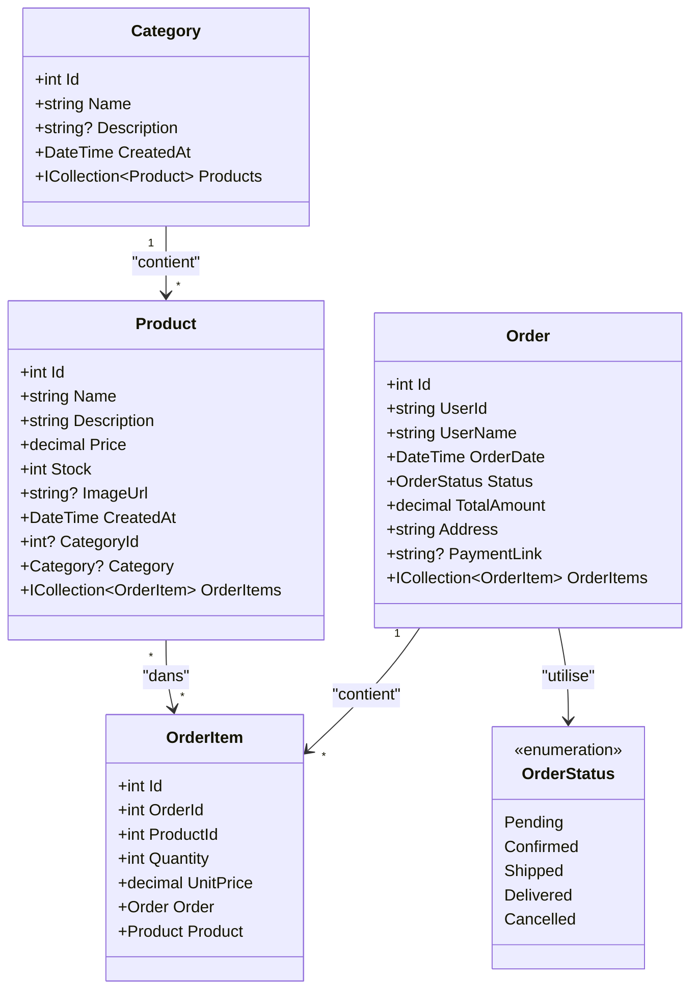

# Diagramme de classes - Base de données MyApp

## Relations

- **Category → Product** : Une catégorie peut contenir plusieurs produits (relation 1-N)
- **Product → OrderItem** : Un produit peut être dans plusieurs lignes de commande (relation 1-N)
- **Order → OrderItem** : Une commande contient plusieurs lignes de commande (relation 1-N)
- **Order → OrderStatus** : Une commande utilise un statut (enum)

## Notes

- `CategoryId` dans `Product` est nullable, donc un produit peut ne pas avoir de catégorie
- `OrderItem` stocke le prix unitaire au moment de la commande (`UnitPrice`) pour préserver l'historique
- `Order.UserId` et `Order.UserName` stockent les informations utilisateur depuis Keycloak
