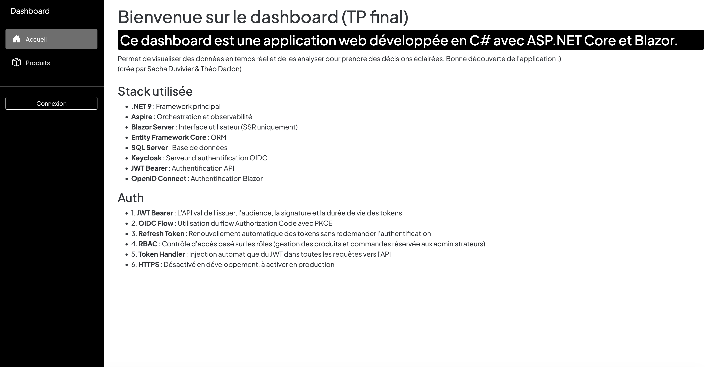

# Application E-Commerce avec Authentification OIDC

> **Projet réalisé par** : Sacha Duvivier & Théo Dadon  
> **Contexte** : TP Final - Application web moderne avec architecture microservices

Bienvenue dans notre application e-commerce ! Ce projet a été développé dans le cadre du TP final pour mettre en pratique les technologies modernes du stack .NET. 

L'application permet de gérer un catalogue de produits, un système de panier, des commandes avec adresses de livraison, et un système de génération de liens de paiement

## 🎯 Ce que fait l'application

Cette application est une plateforme e-commerce complète qui permet :

- **Pour tous les utilisateurs** :
  - Consulter le catalogue de produits avec leurs descriptions, prix et disponibilité
  - Ajouter des produits au panier avec gestion des quantités
  - Passer des commandes en saisissant une adresse de livraison
  - Consulter l'historique de ses commandes avec les détails complets

- **Pour les administrateurs** :
  - Gérer le catalogue de produits (CRUD complet)
  - Rechercher et filtrer les produits
  - Voir toutes les commandes de tous les utilisateurs
  - Modifier le statut des commandes (Pending, Confirmed, Shipped, Delivered, Cancelled)
  - Générer des liens de paiement personnalisés pour chaque commande
  - Consulter les devis détaillés avec tous les articles
